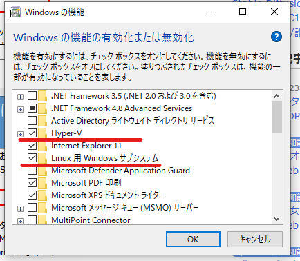
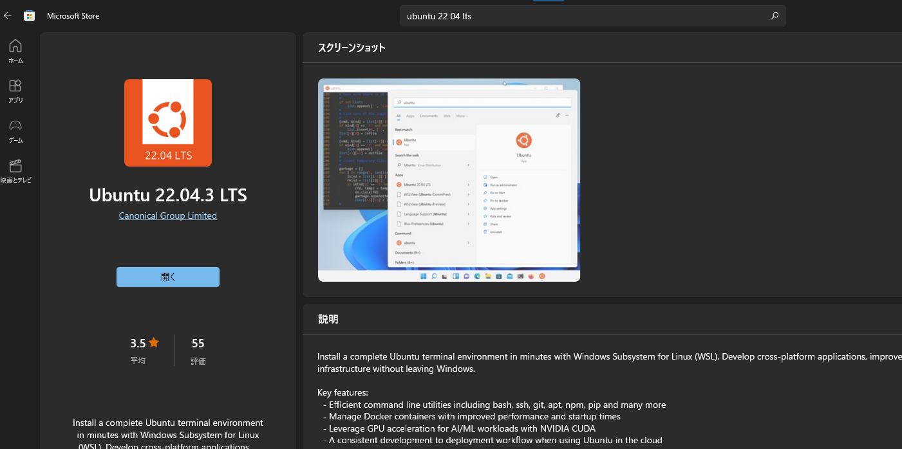
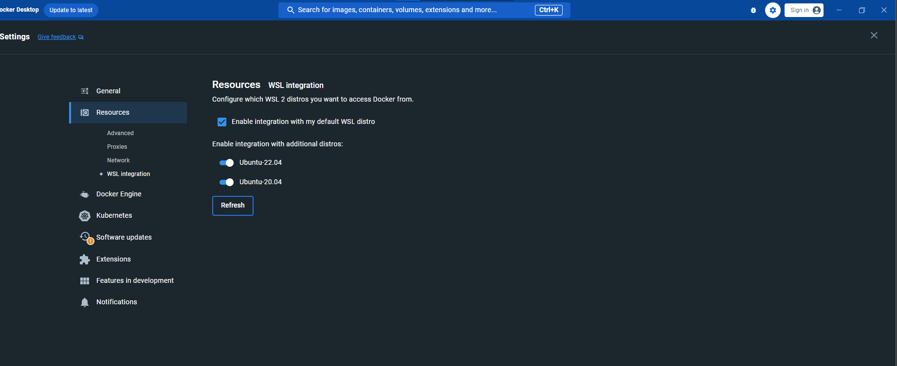

# 環境構築

本アプリケーションで想定している開発環境について記載する。
カリキュラムとしては深く立ち入らないため、あとは個々人で学習すること。

- [環境構築](#環境構築)
  - [本環境の意図](#本環境の意図)
  - [構築手順](#構築手順)
    - [WSL2](#wsl2)
    - [Docker-Desktop（GUIもあり不慣れでも扱いやすさがメリット）](#docker-desktopguiもあり不慣れでも扱いやすさがメリット)
    - [Visual Studio Code](#visual-studio-code)
    - [Javaの実行環境](#javaの実行環境)
    - [ソースコード取得](#ソースコード取得)
    - [動作確認](#動作確認)
  - [参考資料](#参考資料)

## 本環境の意図

Windowsで開発を行う上で必要なツールに触れ、今後他の言語やFWなどで応用するための下地作りを目的に環境を整備している。
また、副次的な効果として、JavaSilverの学習（主にコマンドライン部）にも利用できると考えている。  
※SpringBootの開発環境のベストプラクティスを目指していない。

## 構築手順

[VS CodeでSpringBoot立ち上げ](https://www.i-vinci.co.jp/techblog/1074)を参考に環境構築を行うが、
<b style="color: red; ">
WSL、Docker、Visual Studio Codeのインストーラーは自社指定のものを使うこと（必須）。</b>

### WSL2

1. WSL install
   1. [インストーラー](https://vinci01.sharepoint.com/:f:/s/staff_and_bp/Eg2BsFdrgBpBiYxPijcgsK8BDDFFBhR6usW_LT2Sqd8sHw?e=BTGwfG)をダウンロードする
   2. インストーラーを実行する
   3. Windowsの設定＞コントロールパネルで「Windowsの機能の有効化または無効化」を表示する。
   4. 「Hype-V」と「Windows Subsystem for Linux」または「Linux用Windowsサブシステム」のチェックボックスを「オン」にし、PCを再起動する
   ※Windowwsのバージョンによって項目名が異なります  
   
2. Ubuntu install
   1. Microsoft StoreでUbuntuと検索する
   2. 最新LSTバージョンのイメージをインストールする  
   
   3. インストール完了後に自動でUbuntuのターミナルが起動するため、手順にユーザー名とパスワードを設定する
      1. ユーザー名はUbuntu内でつかう自身のユーザー名となる。パスワードはrootユーザーになる際に利用する（紛失しないこと）
3. Ubuntuを最新化

   ```bash
   sudo su
   apt update && apt upgrade -y`
   ```

### Docker-Desktop（GUIもあり不慣れでも扱いやすさがメリット）

1. Docker-Desktop install
   1. [インストーラー](https://vinci01.sharepoint.com/:f:/s/staff_and_bp/En3tPPwDcLhLhl_gNB86ys8BNOcAuX-cPScufnVF2g4Qvg?e=jwqpSU)をダウンロードする
   2. インストーラーを実行する
2. DockerをWSL(Ubuntu)にアタッチ
   1. Resources>WSL integration からDockerを利用したいUbuntuを選択する  
   

### Visual Studio Code

1. エディタインストール
   1. [インストーラー](https://vinci01.sharepoint.com/:f:/s/staff_and_bp/Es6u79Vf3MdEh1pYwIFP0ccBiZ9AzwUlGwTb6gtrP2McDg?e=QDyHyg)をダウンロードする
   2. インストーラーを実行する
2. ローカル環境に拡張機能を追加する
   1. WSL
3. WSLへのアタッチ
   1. 画面左下の><をおすと画面中央で「ディストリビューションを使用して新しいWSLウィンドウ...」で接続先を選ぶ
   2. VS Codeが再度立ち上がり、左下がWSLに接続済みである旨が表示されていることを確認する
4. WSL環境に拡張機能を追加する
   1. Docker
   2. Gradle for Java
   3. Spring Boot Extension Pack
   4. Extension Pack for Java

### Javaの実行環境

1. JDK install

   ```bash
   apt list | grep jdk
   # 上記コマンドでほしいバージョンが出ない場合はupdateすること
   # apt update && apt upgrade
   apt install -y openjdk-17-jdk
   java -version
   ```

### ソースコード取得

1. プロジェクトを作成したいディレクトリへ移動し、git cloneする

   ```bash
   cd /home/username/dev
   git clone https://github.com/i-v-FSD/springTraining.git
   ```

### 動作確認

   1. MySQLコンテナをビルド
   2. Springプロジェクト立ち上げ

## 参考資料

- [WindowsでWSL2+Dockerを使うための環境構築](https://qiita.com/minato-naka/items/84508472c04f628e576e)
- [Windows上のVS CodeでRemote-WSLを使い。WSL2のUbuntu 20.04へアクセスする。](https://zenn.dev/s_ryuuki/articles/4b9631674adea4)
- [VS CodeでSpringBoot立ち上げ](https://www.i-vinci.co.jp/techblog/1074)
